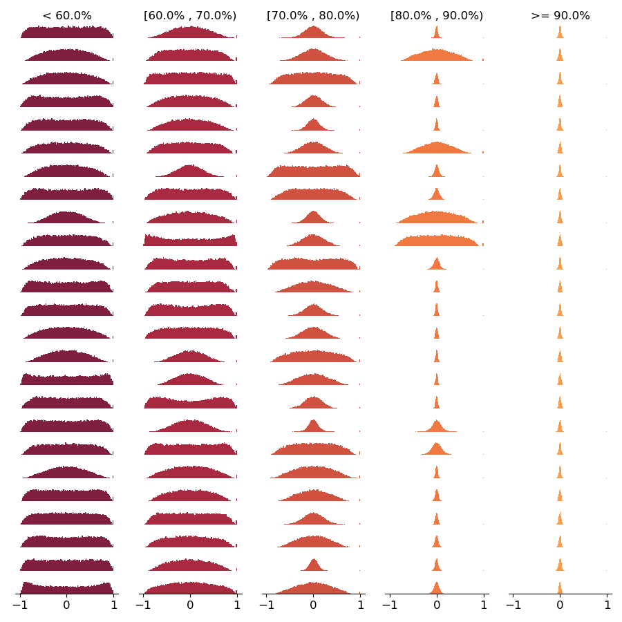

# [Neural Architecture Search Without Training](https://arxiv.org/abs/2006.04647)

This repository contains code for replicating our paper, [NAS Without Training](https://arxiv.org/abs/2006.04647).

## Setup

1. Download the [datasets](https://drive.google.com/drive/folders/1L0Lzq8rWpZLPfiQGd6QR8q5xLV88emU7).
2. Download [NAS-Bench-201](https://drive.google.com/file/d/16Y0UwGisiouVRxW-W5hEtbxmcHw_0hF_/view).
3. Install the requirements in a conda environment with `conda env create -f environment.yml`.

We also refer the reader to instructions in the official [NAS-Bench-201 README](https://github.com/D-X-Y/NAS-Bench-201).

## Reproducing our results

To reproduce our results:

```
conda activate nas-wot
./reproduce.sh 3 # average accuracy over 3 runs
./reproduce.sh 500 # average accuracy over 500 runs (this will take longer)
```

Each command will finish by calling `process_results.py`, which will print a table. `./reproduce.sh 3` should print the following table:

| Method       |   Search time (s) | CIFAR-10 (val)   | CIFAR-10 (test)   | CIFAR-100 (val)   | CIFAR-100 (test)   | ImageNet16-120 (val)   | ImageNet16-120 (test)   |
|:-------------|------------------:|:-----------------|:------------------|:------------------|:-------------------|:-----------------------|:------------------------|
| Ours (N=10)  |              1.75 | 89.50 +- 0.51    | 92.98 +- 0.82     | 69.80 +- 2.46     | 69.86 +- 2.21      | 42.35 +- 1.19          | 42.38 +- 1.37           |
| Ours (N=100) |             17.76 | 87.44 +- 1.45    | 92.27 +- 1.53     | 70.26 +- 1.09     | 69.86 +- 0.60      | 43.30 +- 1.62          | 43.51 +- 1.40       

`./reproduce 500` will produce the following table:

| Method       |   Search time (s) | CIFAR-10 (val)   | CIFAR-10 (test)   | CIFAR-100 (val)   | CIFAR-100 (test)   | ImageNet16-120 (val)   | ImageNet16-120 (test)   |
|:-------------|------------------:|:-----------------|:------------------|:------------------|:-------------------|:-----------------------|:------------------------|
| Ours (N=10)  |              1.67 | 88.61 +- 1.58    | 91.58 +- 1.70     | 67.03 +- 3.01     | 67.15 +- 3.08      | 39.74 +- 4.17          | 39.76 +- 4.39           |
| Ours (N=100) |             17.12 | 88.43 +- 1.67    | 91.24 +- 1.70     | 67.04 +- 2.91     | 67.12 +- 2.98      | 40.68 +- 3.41          | 40.67 +- 3.55           |


To try different sample sizes, simply change the `--n_samples` argument in the call to `search.py`, and update the list of sample sizes [this line](https://github.com/BayesWatch/nas-without-training/blob/master/process_results.py#L51) of `process_results.py`.

Note that search times may vary from the reported result owing to hardware setup.


## Plotting histograms

In order to plot the histograms in Figure 1 of the paper, run:

```
python plot_histograms.py
```
to produce:



The code is licensed under the MIT licence.

## Acknowledgements

This repository makes liberal use of code from the [AutoDL](https://github.com/D-X-Y/AutoDL-Projects) library. We also rely on [NAS-Bench-201](https://github.com/D-X-Y/NAS-Bench-201).

## Citing us

If you use or build on our work, please consider citing us:

```
@misc{mellor2020neural,
    title={Neural Architecture Search without Training},
    author={Joseph Mellor and Jack Turner and Amos Storkey and Elliot J. Crowley},
    year={2020},
    eprint={2006.04647},
    archivePrefix={arXiv},
    primaryClass={cs.LG}
}
```
